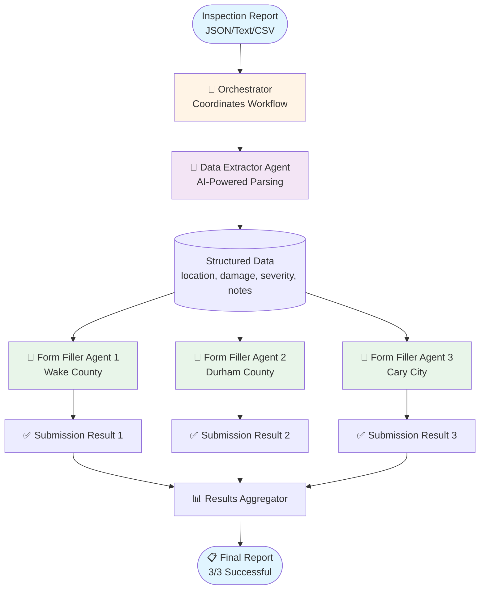
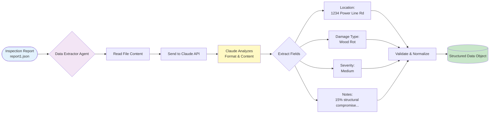
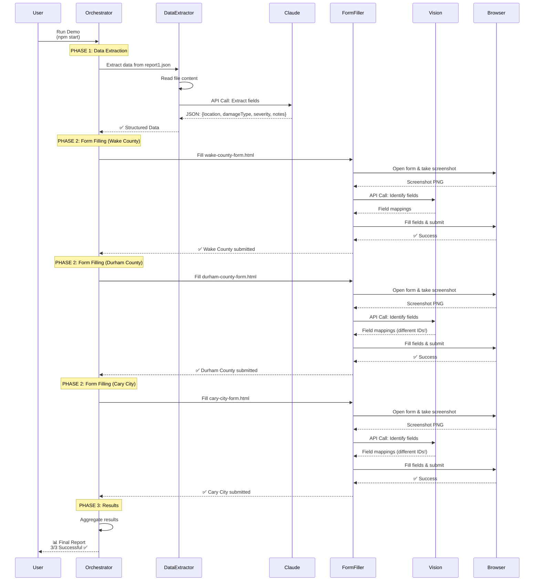
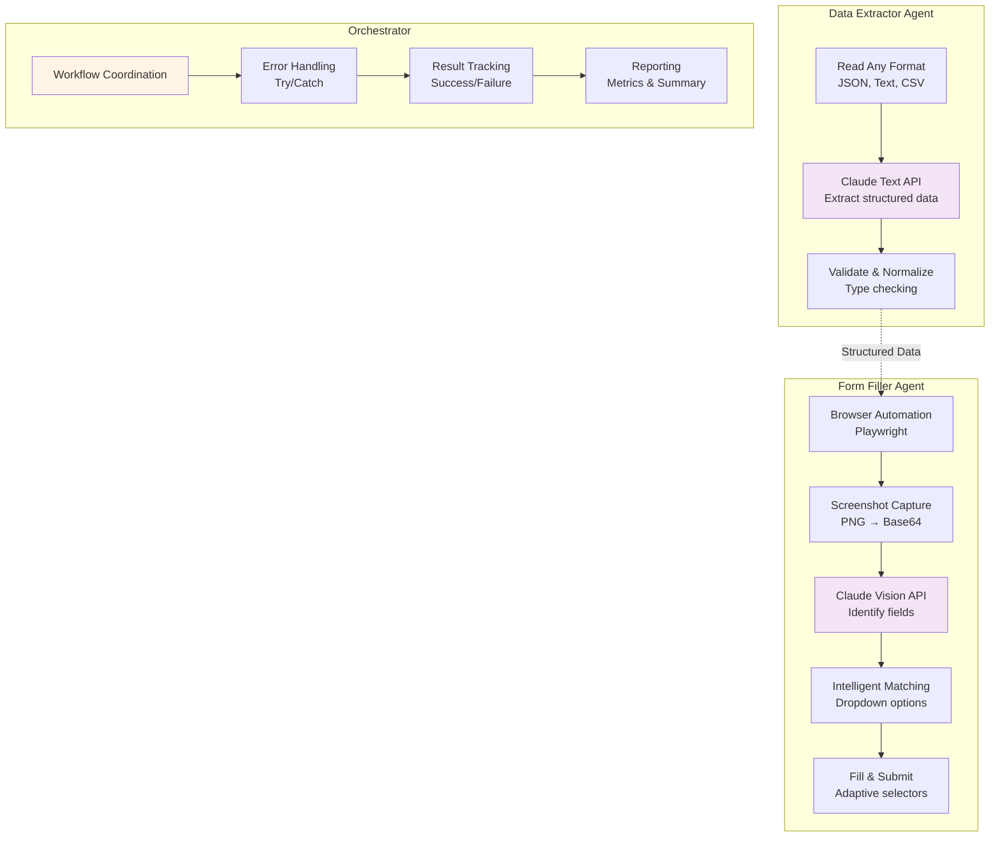
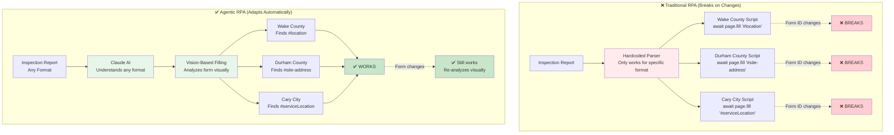
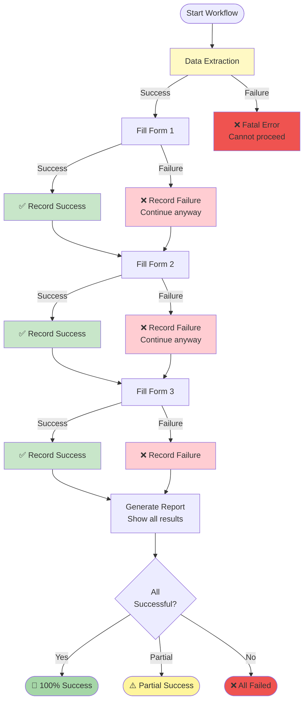
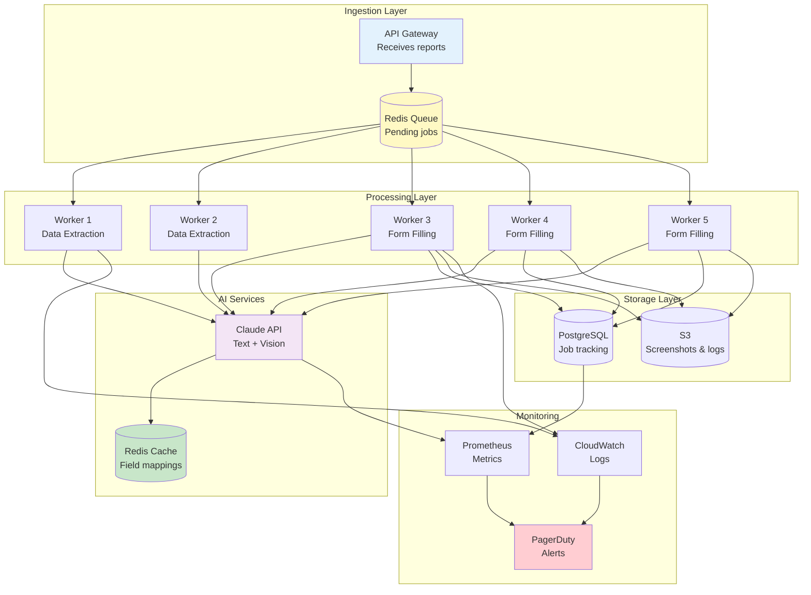

# System Flow Diagrams

Copy and paste these into Notion. Use `/code` and select "Mermaid" as the language.

---

## Overall System Architecture



---

## Detailed Data Extraction Flow



---

## Vision-Based Form Filling Flow

```mermaid
graph TB
    Start([Form URL]) --> Open[Open Form in Browser<br/>Playwright]

    Open --> Screenshot[Take Full-Page Screenshot<br/>PNG Image]
    Screenshot --> Base64[Convert to Base64<br/>Binary → Text]

    Base64 --> Vision[Send to Claude Vision API<br/>Image + Prompt]

    Vision --> Analyze[Claude Analyzes Screenshot<br/>- Reads field labels<br/>- Identifies input types<br/>- Finds selectors]

    Analyze --> Fields[Field Mappings Returned<br/><code>location: #site-address<br/>damageType: #issue-category<br/>severity: #urgency<br/>notes: #description</code>]

    Fields --> Fill{For Each Field}

    Fill --> |Input| FillText[Type Text Value<br/>page.fill selector, value]
    Fill --> |Select| FillDropdown[Match & Select Option<br/>page.selectOption selector, value]
    Fill --> |Textarea| FillNotes[Type Long Text<br/>page.fill selector, notes]

    FillText --> Check{All Fields<br/>Filled?}
    FillDropdown --> Check
    FillNotes --> Check

    Check --> |No| Fill
    Check --> |Yes| Submit[Click Submit Button<br/>page.click 'button[type=submit]']

    Submit --> Success([✅ Form Submitted])

    style Start fill:#e3f2fd
    style Vision fill:#f3e5f5
    style Analyze fill:#fff9c4
    style Fields fill:#c8e6c9
    style Success fill:#a5d6a7
```

---

## Complete End-to-End Workflow



---

## Agent Architecture



---

## Traditional RPA vs Agentic RPA



---

## Error Handling Flow



---

## Production Scaling Architecture



---

## How to Use in Notion

1. Copy any diagram above (including the ```mermaid markers)
2. In Notion, type `/code`
3. Select "Mermaid" as the language
4. Paste the diagram code
5. Notion will render it as an interactive diagram

You can resize, zoom, and export the diagrams directly in Notion!
